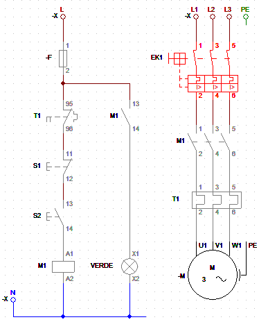
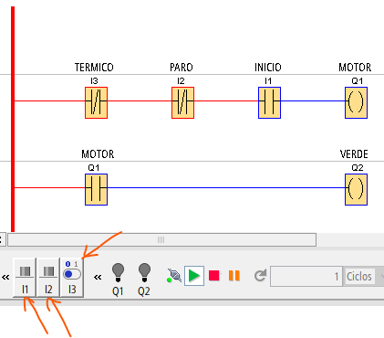

# CURSO PLC LOGO CON EJEMPLOS

- [CURSO PLC LOGO CON EJEMPLOS](#curso-plc-logo-con-ejemplos)
  - [INTRODUCCIÓN](#introducción)
  - [Marcha-Paro por Impulso](#marcha-paro-por-impulso)
    - [Arranque de un motor trifásico por impulso con luz de piloto](#arranque-de-un-motor-trifásico-por-impulso-con-luz-de-piloto)
    - [Conexión en 3D PLC LOGO en CADeSimu](#conexión-en-3d-plc-logo-en-cadesimu)

- - -

## INTRODUCCIÓN

- CADe-Simu v4
- LOGO-SOFT v3 (disponible v4)

Para programas con problemas de compatibilidad en W10,sobre el icono de la aplicación, clic en botón derecho y seleccionar _Propiedades > Compatibilidad_. Marcar la opción: _Ejecutar este programa como admnistrador_. Hacer clic en _Cambiar configuración elevada de PPP_. Marcar: _Invalidar el comportaminto de ajuste de PPP alto_. Desplegar y seleccionar: _Sistema_. Aceptar y aplicar cambios.

- - -

## Marcha-Paro por Impulso

### Arranque de un motor trifásico por impulso con luz de piloto

Esquema cableado del _Marcha-Paro_:

Esquema de contactos en KOP del _Marcha-Paro_. Se utilizan dos pulsadores normalmente abiertos para las entradas I1 e I2 correspondientes al _Marcha S1_ y al _Paro S2_. El térmico es un interruptor:

### Conexión en 3D PLC LOGO en CADeSimu

