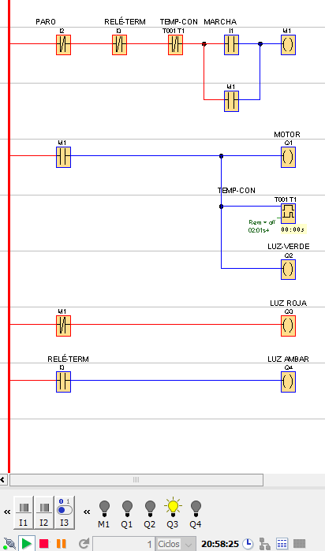

# CURSO PLC LOGO CON EJEMPLOS

- [CURSO PLC LOGO CON EJEMPLOS](#curso-plc-logo-con-ejemplos)
  - [INTRODUCCIÓN](#introducción)
  - [Marcha-Paro por Impulso](#marcha-paro-por-impulso)
    - [Arranque de un motor trifásico por impulso con luz de piloto](#arranque-de-un-motor-trifásico-por-impulso-con-luz-de-piloto)
    - [Conexión en 3D PLC LOGO en CADeSimu](#conexión-en-3d-plc-logo-en-cadesimu)
  - [Marcha-Paro con Tres Luces Piloto](#marcha-paro-con-tres-luces-piloto)
    - [Arranque de un Motor Trifásico](#arranque-de-un-motor-trifásico)
  - [Marcha-Paro con dos Putos de Encenddo y tres Luces](#marcha-paro-con-dos-putos-de-encenddo-y-tres-luces)
    - [Arranque de un Motor con dos Puntos de Encendido](#arranque-de-un-motor-con-dos-puntos-de-encendido)
  - [Inversión de Sentido de Giro Motor Monofásico](#inversión-de-sentido-de-giro-motor-monofásico)
    - [Arranque Motor Monofásico con Inversión de Giro](#arranque-motor-monofásico-con-inversión-de-giro)
  - [Inversión de Sentido de Giro Motor Trifásico](#inversión-de-sentido-de-giro-motor-trifásico)
    - [Esquema de contactos cableado Giro Motor Trifásico](#esquema-de-contactos-cableado-giro-motor-trifásico)
    - [Esquema KOP y conexiones en CADe-SIMU Giro Motor Trifásico](#esquema-kop-y-conexiones-en-cade-simu-giro-motor-trifásico)
  - [Arranque de un Motor Trifásico con Apagado Programado](#arranque-de-un-motor-trifásico-con-apagado-programado)
    - [Esquema de contactos cableado con Apagado Programado](#esquema-de-contactos-cableado-con-apagado-programado)
    - [Esquema KOP y conexiones en CADe-SIMU Apagado Motor Trifásico](#esquema-kop-y-conexiones-en-cade-simu-apagado-motor-trifásico)

- - -

## INTRODUCCIÓN

- CADe-Simu v4
- LOGO-SOFT v3 (disponible v4)

Para programas con problemas de compatibilidad en W10,sobre el icono de la aplicación, clic en botón derecho y seleccionar _Propiedades > Compatibilidad_. Marcar la opción: _Ejecutar este programa como admnistrador_. Hacer clic en _Cambiar configuración elevada de PPP_. Marcar: _Invalidar el comportaminto de ajuste de PPP alto_. Desplegar y seleccionar: _Sistema_. Aceptar y aplicar cambios.

- - -

## Marcha-Paro por Impulso

### Arranque de un motor trifásico por impulso con luz de piloto

Esquema cableado del _Marcha-Paro_:

Esquema de contactos en KOP del _Marcha-Paro_. Se utilizan dos pulsadores normalmente abiertos para las entradas I1 e I2 correspondientes al _Marcha S1_ y al _Paro S2_. El térmico es un interruptor:

### Conexión en 3D PLC LOGO en CADeSimu

- - -

## Marcha-Paro con Tres Luces Piloto

### Arranque de un Motor Trifásico

> [!tip]
> **Contacto Directo**. Se comporta de manera directa a la realidad. 
> **Contacto Negado**. Se comporta de manera inversa a la realidad.

- - -

## Marcha-Paro con dos Putos de Encenddo y tres Luces

### Arranque de un Motor con dos Puntos de Encendido

- - -

## Inversión de Sentido de Giro Motor Monofásico

### Arranque Motor Monofásico con Inversión de Giro

- - -

## Inversión de Sentido de Giro Motor Trifásico

### Esquema de contactos cableado Giro Motor Trifásico

### Esquema KOP y conexiones en CADe-SIMU Giro Motor Trifásico

- - -

## Arranque de un Motor Trifásico con Apagado Programado

### Esquema de contactos cableado con Apagado Programado

### Esquema KOP y conexiones en CADe-SIMU Apagado Motor Trifásico

- - -
